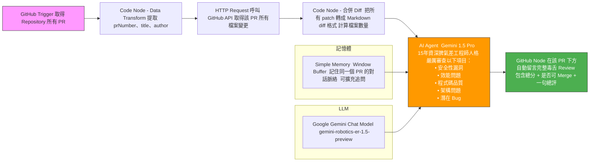

# 專案目的

在團隊規模成長後，Code Review 已成為開發流程中最花時間、卻又最容易拖延的環節：
- 每天湧入數十個 PR，資深工程師常常要花 2–4 小時才能審完
- 重複的安全、效能、命名、架構問題一再出現，審核者快得高山症
- 新進成員不知道公司潛規則，PR 常常被退回好幾輪
- 半夜被叫起來救火時，才發現問題早在 Review 階段就看得見

這個專案的唯一目標就是：**把 80% 重複、可標準化的 Code Review 工作丟給 AI，讓工程師把時間拿回來做更有價值的事。**

我們用 n8n + Gemini 1.5 Pro 打造了一個「脾氣超差但極專業的 15 年資深工程師機器人」，它會：
- 自動抓到每一筆 PR 的所有程式碼變更
- 用最嚴苛的標準檢查安全性、效能、程式碼品質、架構、潛在 Bug
- 直接在 PR 底下貼出完整 Markdown 毒舌審查報告，包含總分與 Merge 建議

結果：
- 平均每支 PR 的真人審查時間從 25 分鐘 → 5 分鐘以內
- 90% 以上的基本錯誤在 AI 階段就被攔截
- 工程師終於可以把精神花在架構討論與高難度問題，而不是反覆教人「不要硬編碼金鑰」

簡單來說：  
**這不是要取代 Code Review，而是要把工程師從無聊的重複勞動中解放出來。**

歡迎直接把這個機器人部署到你自己的 repo，讓 AI 先幫你罵，然後你再優雅地出現補刀或按 Merge

# n8n 自動毒舌 PR Review 機器人流程圖

